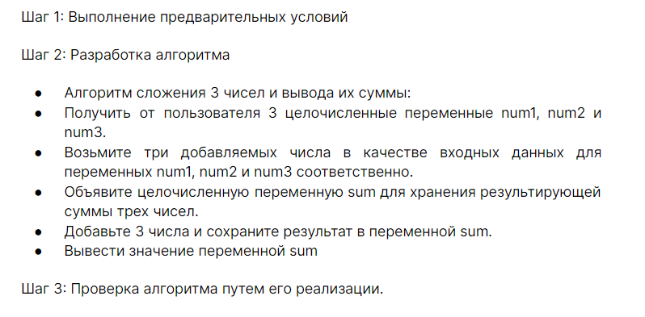
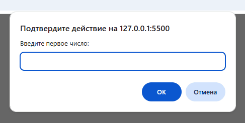

# Домашнее задание 1.

Написать псевдокод для алгоритма: сложить три числа и вывести сумму.
Реализовать алгоритм в коде  на Javascript.


## Решение

```
НАЧАЛО
  1: Получить входные данные
  - Запросить у пользователя num1
  - Запросить у пользователя num2
  - Запросить у пользователя num3

  2: Выполнить вычисление
  - Объявить переменную 'сумма'
  - Присвоить 'сумма' = num1 + num2 + num3

  : Вывести результат
  - Вывести значение переменной 'сумма'
КОНЕЦ
```

Код

```JavaScript
let num1 = parseInt(prompt('Введите первое число:'))
let num2 = parseInt(prompt('Введите второе число:'))
let num3 = parseInt(prompt('Введите третье число:'))

let sum = num1 + num2 + num3

alert('Сумма трех чисел равна: ' + sum)
```




