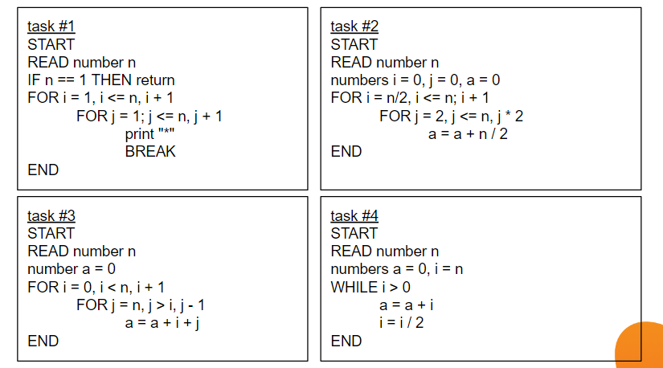

# Домашнее задание 2.

1. Познакомиться с Задачей коммивояжёра. Объясните своими словами, какова ее сложность?
2. Решить практические задачи 1-4: какова временная сложность?
   

## Решение

1. Задача коммивояжёра.

   Сложность задачи коммивояжёра не в том, чтобы найти какой-то маршрут, а в том, чтобы найти самый лучший. Кажется, что можно просто перебрать все варианты и выбрать самый короткий. Но здесь и есть проблема.
   Количество возможных маршрутов растет факториально с добавлением каждого нового города.
   Невозможно перебрать все варианты для нескольких десятков городов за разумное время.
   Не существует известного алгоритма, который бы мог найти гарантированно оптимальное решение для большого количества городов за приемлемое время. Вместо этого на практике используются приближенные алгоритмы, которые находят не идеальное, а достаточно хорошее решение.
2. Практические задачи.

### Задача #1

Временная сложность: O(n) — Линейная

Объяснение:
Внешний цикл выполняется n раз. Внутренний цикл тоже должен выполняться n раз. Однако из-за команды BREAK он прерывается сразу же после первой итерации. Таким образом, на каждую из n итераций внешнего цикла приходится всего одна операция внутреннего. Общее число операций пропорционально n.

### Задача #2
Временная сложность: O(n log n) — Линейно-логарифмическая

Объяснение:
Внешний цикл O(n).
Внутренний цикл является логарифмическим. Переменная j удваивается на каждом шаге, поэтому количество итераций будет равно log2n.
Поскольку циклы вложены, их сложности перемножаются. В итоге получаем O(n log n).

### Задача #3
Временная сложность: O(n2) — Квадратичная

Объяснение:
Внешний цикл выполняется n раз.
Внутренний цикл зависит от i:
Когда i = 0, внутренний цикл выполняется n раз.
Когда i = 1, он выполняется n-1 раз.
...и так далее, пока для i = n-1 он не выполнится 1 раз.
Общее число операций — это сумма арифметической прогрессии n(n+1)/2. При оценке сложности учитывается член с наибольшей степенью, т.е. O(n2) .

### Задача #4
Временная сложность: O(log n) — Логарифмическая

Объяснение:
Здесь всего один цикл. На каждой итерации значение i уменьшается вдвое. Деление на 2 — типичный логарифмический процесс.