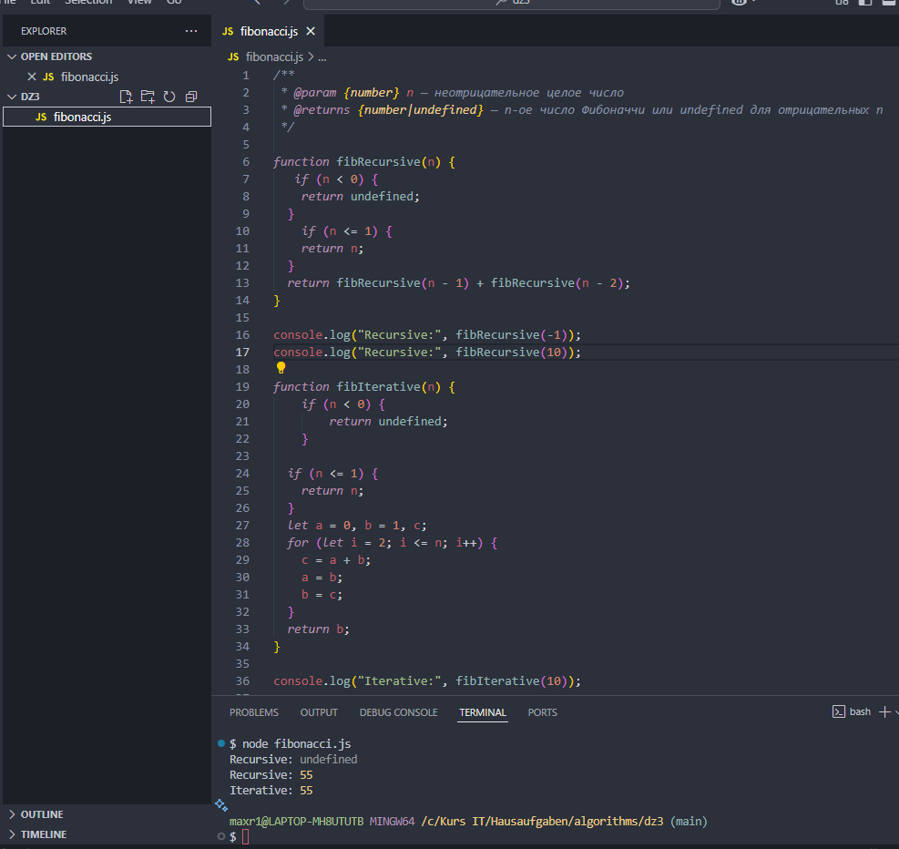
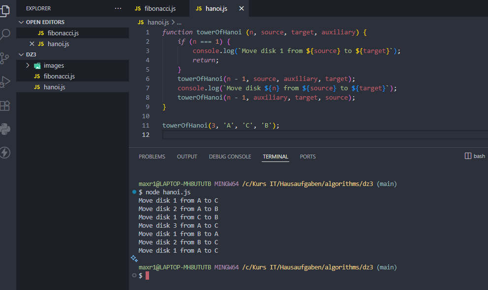

# Домашнее задание 3.

1. Реализуйте с помощью рекурсии и итерационно следующие функции число Фиббоначи.

2. Ознакомьтесь с задачей Ханойская башня и изучите ее решение (сыграйте в игру для лучшего понимания ХАНОЙСКАЯ БАШНЯ).

