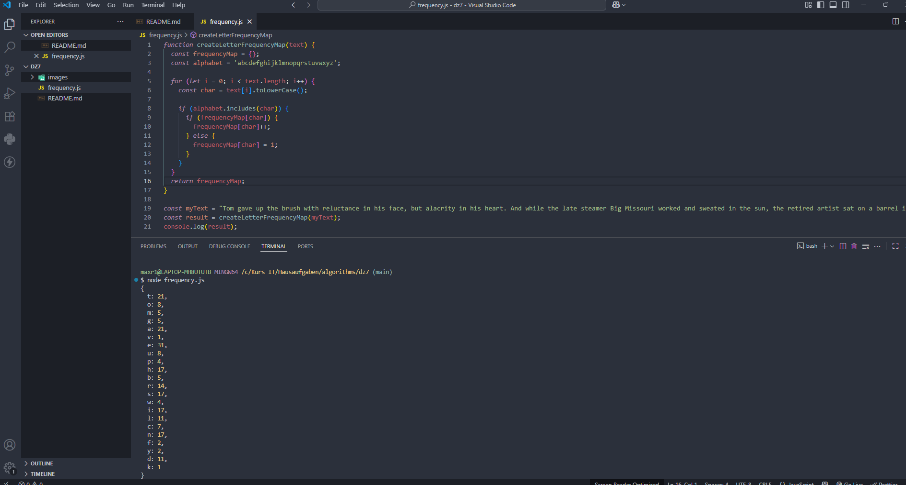

# Домашнее задание 7.

Постройте частотный словарь букв английского алфавита. Частотный словарь букв - это структура данных или набор информации, который содержит информацию о том, какие буквы встречаются в тексте и с какой частотой.

