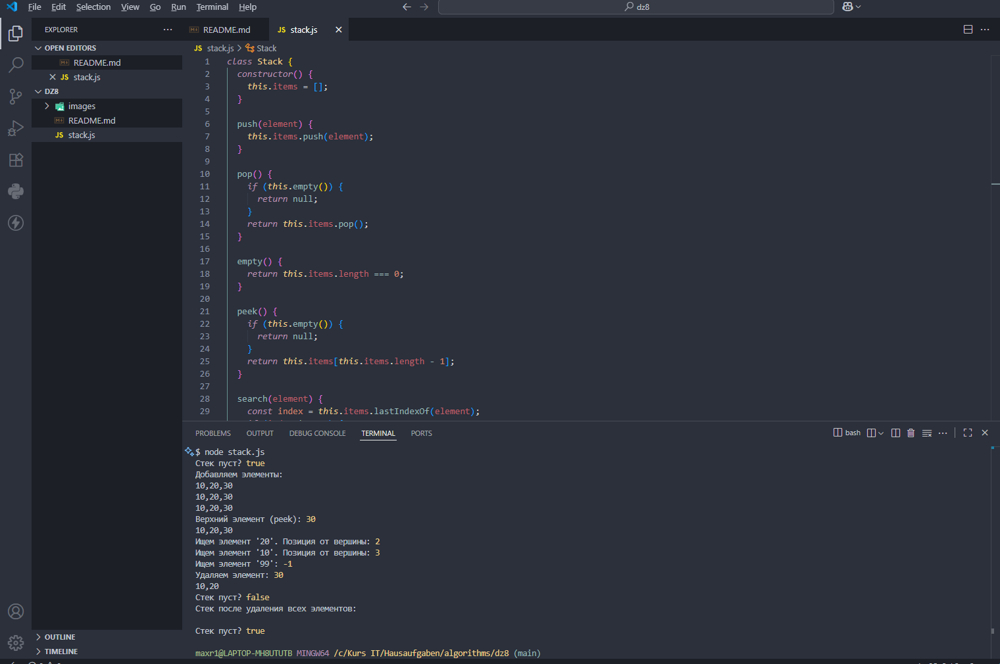

# Домашнее задание 8.

Реализовать стек и его операции на основе массива. 

- empty  — проверка стека на наличие в нем элементов,
- push  — операция вставки нового элемента,
- pop  — операция удаления нового элемента.

Реализовать нижеперечисленные операции самостоятельно для структуры Стек:

- peek() – Возвращает элемент c вершины стека, но не удаляет его.
- search(element) -  Определяет, существует ли объект в стеке. Если элемент найден, возвращает позицию элемента с вершины стека. В противном случае он возвращает -1.

